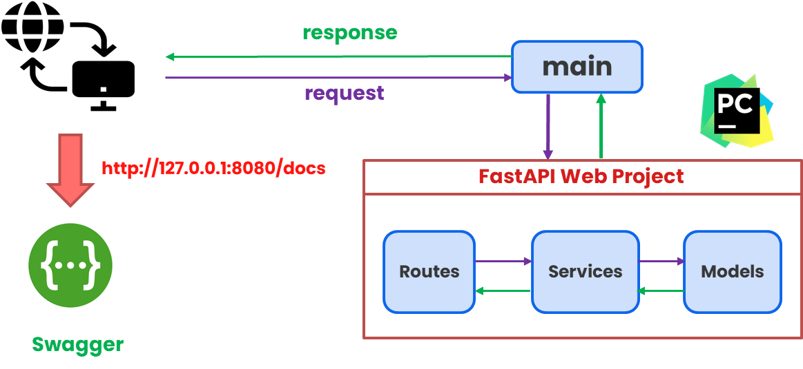
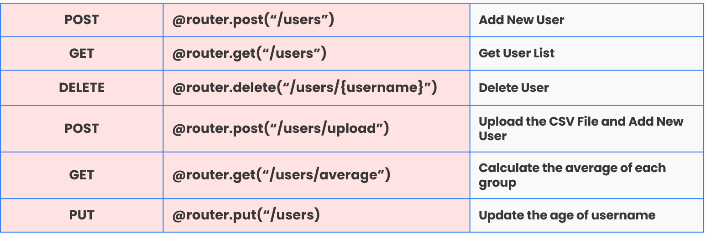
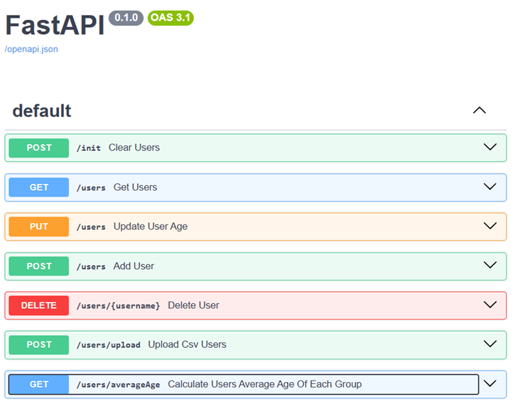

# RESTFUL API DESIGN

## Requirement
- RESTFUL API DESIGN
- POST API (新增 User，包含 name & age)
- DELETE API (刪除 User)
- PUT API (更新 User 的年齡)
- GET API (取得 User List)
- POST API (從 CSV 檔案中讀取資料並新增 User)
- GET API (取得從 CSV 檔案中的 User List)
- GET API (計算平均年齡 & 以 User 的第一個字母排序)
- 使用 Swagger 檢視 RESTFUL API 文件

## Environment
- IDE : PyCharm
- Framework : Python FastAPI
- Data Verification : Pydantic

## Structure Diagram

## RESTFUL API

## Swagger RESTFUL API

## Report
- Test Cases : 38
- Code Coverage : 100%